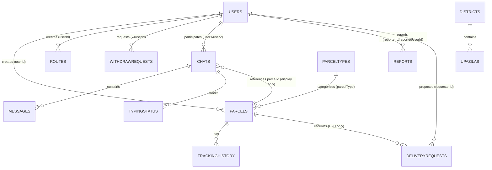
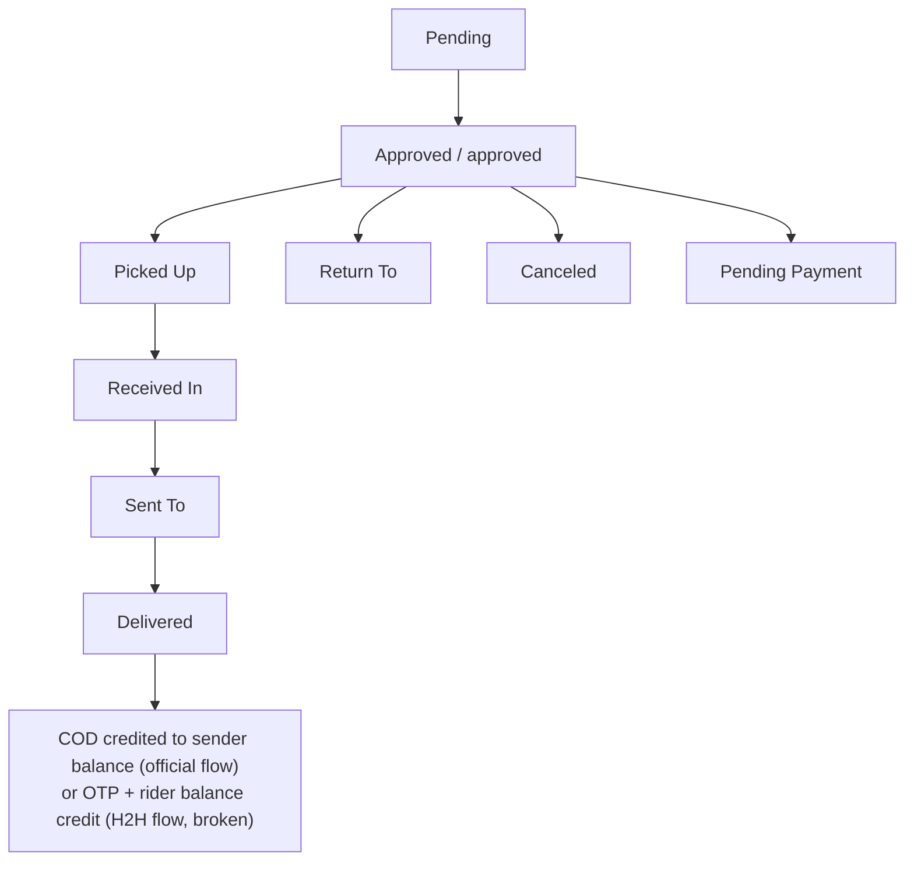
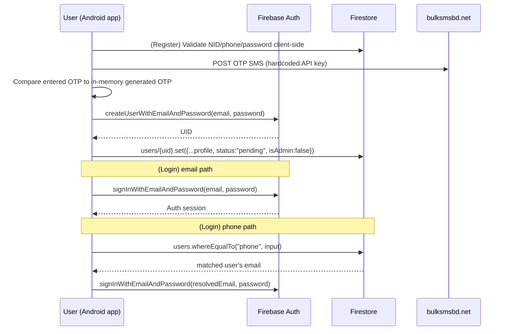
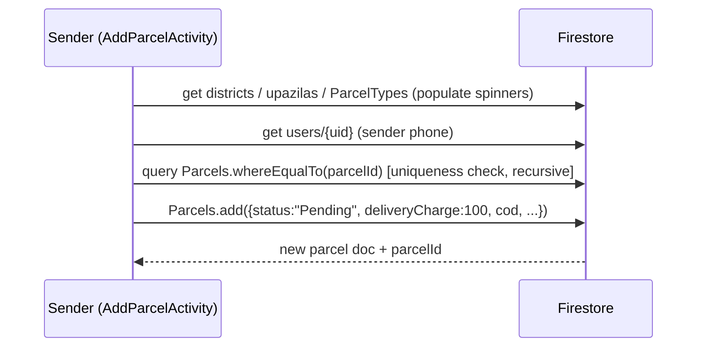
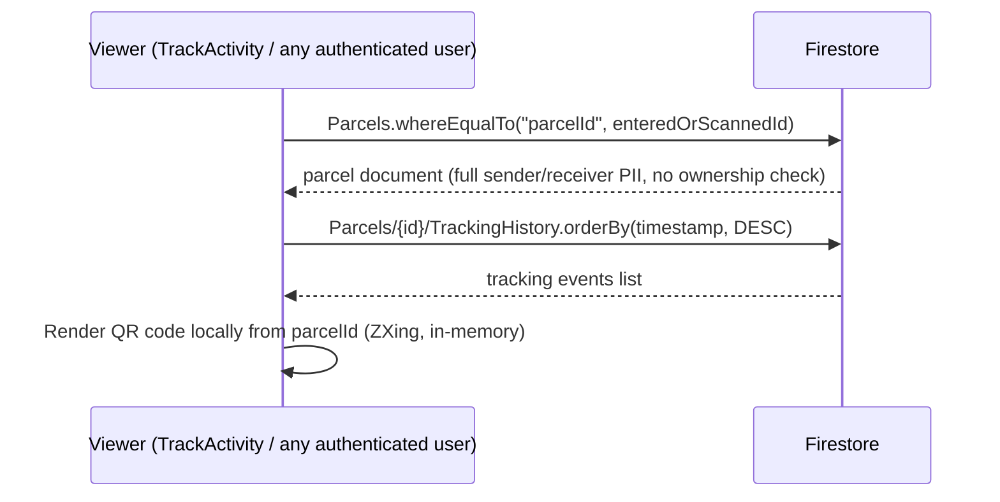
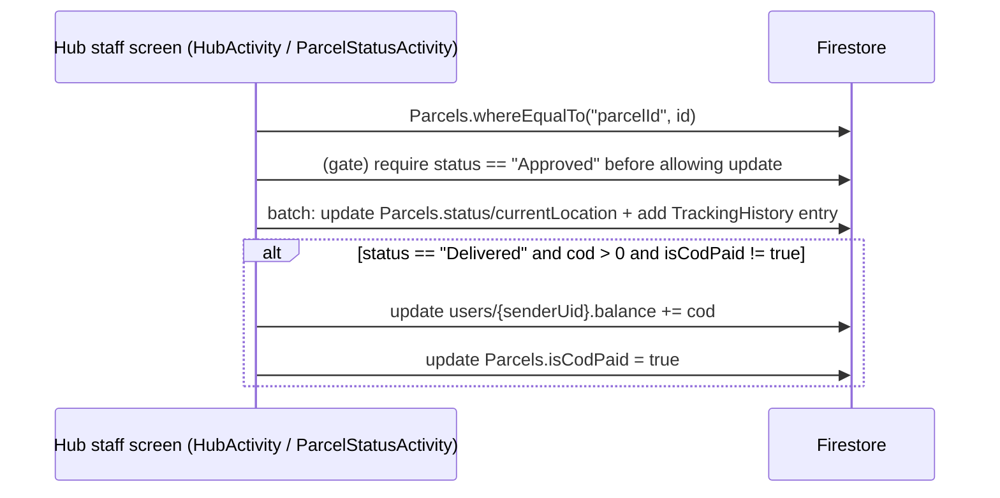
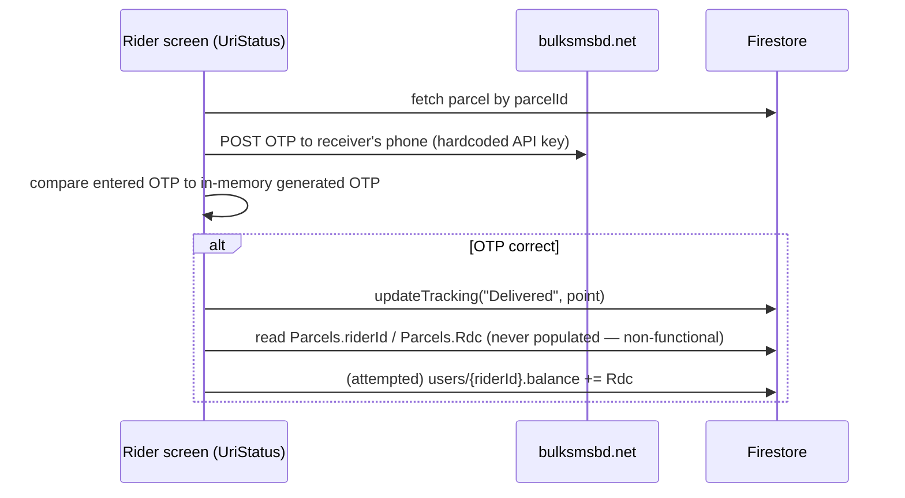
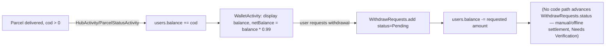

# URI Courier — Technical & Data Structure Documentation

> Reverse-engineered from the existing URI Courier source code.
> This document describes the implementation found in the repository and does not represent a proposed future architecture.

---

## 1. Investor-Facing Technical Summary

**What URI Courier is, technically:** URI Courier ("Project Uri", Android package `com.zerodevs.projecturi`) is a **native Android application** (Java) for a Bangladesh-focused parcel courier and peer-to-peer ("Hand-to-Hand" / H2H) delivery service. There is **no separate custom backend server** (no Node/Express/PHP/Java backend project in this repository). The app talks **directly to Google Firebase** as its backend-as-a-service: Cloud Firestore is the primary database, Firebase Authentication handles login, and a single Firebase Cloud Function (`functions/index.js`) sends a chat push notification. This is a common "serverless mobile app" architecture, not a traditional client → REST API → server → database stack.

- **Core system modules found in code:** user registration/login, official parcel booking (sender → hub → delivery), peer-to-peer "H2H" parcel requests between individual users acting as informal couriers, in-app chat between sender and rider, QR/barcode-based parcel identification, hub/admin parcel processing screens, wallet/balance and withdrawal requests, route posting by riders, push notifications (OneSignal + Firebase Cloud Messaging in parallel).
- **Technology stack:** Android (Java, Gradle), Firebase (Firestore, Auth, Realtime Database dependency present but unused in code read, Cloud Messaging, Storage dependency present but upload flow incomplete), Firebase Cloud Functions (Node.js 22), OneSignal, ZXing (QR/barcode), a third-party SMS gateway (bulksmsbd.net) for OTP.
- **Database technology:** **Google Cloud Firestore** (NoSQL document database), confirmed as the collection referenced throughout the Java source (`FirebaseFirestore.getInstance()`).
- **Major business entities:** `users`, `Parcels` (with `TrackingHistory` and `DeliveryRequests` subcollections), `Routes`, `Chats` (with `Messages` and `typingStatus` subcollections), `WithdrawRequests`, `Points`, `ParcelTypes`, `DeliveryTypes`, `districts`/`upazilas`, `Blocked`, `Reports`.
- **API architecture:** There is **no REST/GraphQL API layer**. The mobile client reads and writes Firestore documents directly using the Firebase Android SDK. The only server-side code is one Cloud Function.
- **Authentication:** Firebase Authentication, email/password only (phone login resolves phone → email first). No visible email verification, no password-reset UI in the code read, no formal RBAC (role field exists on `users` but is never written by any code path found).
- **Courier lifecycle:** Parcel created by sender → status `Pending` → hub/admin approves and processes via `HubActivity`/`ParcelStatusActivity` → status transitions through `Picked Up` / `Received In` / `Sent To` / `Delivered` / `Return To`, each logged to a `TrackingHistory` subcollection → COD settlement to the sender's wallet balance on delivery.
- **Tracking architecture:** Append-style `TrackingHistory` subcollection per parcel document, plus QR-code scan-to-lookup by `parcelId`.
- **Payment/COD architecture:** No payment gateway integration was found. "Payment" in this app means an internal ledger (`balance` field on the `users` document) credited on delivery, and a manual `WithdrawRequests` queue (bKash/Nagad/Rocket selection is just a label — no gateway API call is made).
- **External integrations found:** OneSignal (push), Firebase Cloud Messaging (push), bulksmsbd.net (SMS OTP, **API key hardcoded in the client app** — see Security Review), Google Maps Platform (API key present in manifest), ZXing (QR/barcode).
- **Deployment architecture:** Firebase project `projecturi-00360` (see `.firebaserc`), Firebase Cloud Functions deployed via `firebase deploy --only functions`; the Android app is built/distributed as an APK (a prebuilt `app-release.apk` is committed under `app/release/`).

This summary is based solely on what is present in the repository; several features implied by UI strings or manifest entries are **not implemented** (see Section 19).

---

## 2. Technology Stack

| Layer | Technology | Evidence/Location |
|---|---|---|
| Mobile client (frontend + "app") | Native Android, Java 21, Gradle 8.2.2 | `app/build.gradle`, `build.gradle`, `app/src/main/java/...` |
| UI | Android Views/XML layouts, ViewBinding enabled | `app/build.gradle` (`buildFeatures { viewBinding true }`), `app/src/main/res/layout` |
| Database | Google Cloud Firestore (NoSQL document DB) | `FirebaseFirestore.getInstance()` used throughout `app/src/main/java/com/zerodevs/projecturi/*.java` |
| Secondary DB dependency (declared, not observed in use) | Firebase Realtime Database | `implementation 'com.google.firebase:firebase-database'` in `app/build.gradle`; `firebase_url` present in `google-services.json`; no `FirebaseDatabase` read/write call was found in any audited `.java` file except an unused import in `Sender.java` |
| Authentication | Firebase Authentication (email/password) | `LoginActivity.java`, `RegisterActivity.java` |
| File/Object storage (declared, incomplete) | Firebase Storage | `ProfileActivity.java` (StorageReference created, never used to upload) |
| Server-side logic | Firebase Cloud Functions (Node.js 22, Functions v2 SDK) | `functions/index.js`, `functions/package.json` |
| Push notifications | OneSignal SDK (client) + Firebase Cloud Messaging (client + 1 Cloud Function) | `HomeActivity.java`, `UriDetails.java`, `MyFirebaseMessagingService.java`, `functions/index.js` |
| SMS/OTP | Third-party HTTP API, `bulksmsbd.net` | `RegisterActivity.java`, `UriStatus.java` |
| Maps/Places (declared, no usage confirmed in read files) | Google Maps SDK, Places SDK, OSMDroid | `app/build.gradle`, Maps API key in `AndroidManifest.xml` |
| QR/Barcode | ZXing (`journeyapps:zxing-android-embedded`) | `AddParcelActivity` (via `H2hParcel`), `UriDetails`, `TrackActivity`, `HubActivity`, `ParcelStatusActivity`, `QRScannerActivity`, `UriStatus` |
| Charting | MPAndroidChart | `Sender.java` |
| Image loading | Glide, Picasso | `ProfileActivity.java` (Glide, imported/unused visibly), `MessageAdapter.java` (Picasso) |
| PDF generation | Android `android.graphics.pdf.PdfDocument` | `HubActivity.java`, `ParcelStatusActivity.java` (parcel label generation) |
| Hosting/deployment | Firebase project `projecturi-00360` | `.firebaserc`, `firebase.json` |
| Build artifact | Pre-built release APK committed to the repo | `app/release/app-release.apk` |

---

## 3. Repository Structure

```text
UriSocialCouriergit/
├── app/
│   ├── build.gradle                 # App-level Gradle config, dependencies
│   ├── release/                     # A committed, pre-built release APK + metadata
│   └── src/
│       ├── main/
│       │   ├── AndroidManifest.xml  # Activity registry, permissions, API keys
│       │   ├── java/com/zerodevs/projecturi/   # All application code (34 .java files, single package, no sub-packages)
│       │   └── res/                 # Layouts, drawables, strings, colors, menus
│       ├── androidTest/             # Default (unmodified) instrumented test stub
│       └── test/                    # Default (unmodified) unit test stub
├── functions/
│   ├── index.js                     # Single Firebase Cloud Function (chat push notification)
│   └── package.json
├── gradle/, gradlew, gradlew.bat    # Gradle wrapper
├── build.gradle, settings.gradle, gradle.properties
├── firebase.json, .firebaserc       # Firebase project/functions configuration
├── google-services.json             # Firebase client config (contains project IDs/keys — see Security Review)
└── projecturikey-pass-*.jks         # A committed Android signing keystore (see Security Review)
```

There is **no `frontend/` vs `backend/` split**, no `controllers/`, `services/`, or `models/` directory, and no separate web application. All logic lives inside Android `Activity` classes in one flat Java package.

---

## 4. Backend Architecture

The codebase does **not** follow MVC, a service-repository pattern, or any layered backend architecture, because there is no custom backend. The actual request flow is:

```text
Android Activity (UI + business logic combined)
      ↓
Firebase Android SDK (FirebaseAuth / FirebaseFirestore / FirebaseStorage / FirebaseMessaging)
      ↓
Google Firebase Cloud Platform (Firestore database, Auth service)
      ↓
(one exception) Firestore document-create trigger → Cloud Function (functions/index.js) → Firebase Cloud Messaging → recipient device
```

- **Pattern:** None of the standard backend patterns apply. Each `Activity` class (e.g. `AddParcelActivity`, `HubActivity`, `UriStatus`) directly constructs Firestore queries, performs business calculations (e.g., COD crediting, OTP generation), and updates the UI, all in the same class. There is no repository/DAO abstraction, no dependency injection, and no shared "ParcelService" or "UserService" class — each screen re-implements its own Firestore access.
- **Server-side code** is limited to one Cloud Function (`sendChatNotification`), which reacts to new documents in `Chats/{chatId}/Messages/{messageId}` and sends an FCM push to the receiver using a token stored on their `users` document.
- **Firestore Security Rules:** No `firestore.rules` or `storage.rules` file exists anywhere in this repository. It is `Needs Verification` whether security rules are configured directly in the Firebase console (outside version control); based on the repository alone, **access control at the database layer cannot be confirmed**.

---

## 5. Frontend Architecture

- **Framework:** Native Android (Java), not a cross-platform framework (no Flutter/React Native/Kotlin Multiplatform evidence).
- **Build tool:** Gradle (Android Gradle Plugin 8.2.2, `compileSdk`/`targetSdk` 35, `minSdk` 24).
- **Routing:** Standard Android `Intent`-based activity navigation (`startActivity(new Intent(...))`); no navigation graph/Jetpack Navigation component in use.
- **State management:** None in the modern sense (no ViewModel/LiveData usage found for business state, despite `lifecycle-viewmodel`/`lifecycle-livedata-core` being declared as dependencies — no `ViewModel` subclass was found in the audited files). UI state is held as Activity fields.
- **API communication:** Direct Firebase SDK calls (Firestore listeners/queries) from within Activities; one raw `HttpURLConnection` POST call for the SMS OTP API.
- **Authentication state:** `FirebaseAuth.getInstance().getCurrentUser()`, checked ad hoc at the top of activities such as `LoginActivity` (redirects to `HomeActivity` if already signed in) and `Sender`/`ProfileActivity` (loads the current user's Firestore document by UID). There is no central "AuthGuard"/base-class enforcement; most activities assume a signed-in user without null-checking `FirebaseAuth.getInstance().getCurrentUser()`.
- **Component structure:** One shared `BaseActivity` (sets status-bar/navigation-bar appearance and light mode) is extended by nearly all screens. No custom reusable UI component library; each screen inflates its own `activity_*.xml` layout and, for list-style screens, a shared "card" layout (`item_parcel_card.xml`, `item_routes_card.xml`, etc.) inflated manually.

### 5.1 Frontend Module Map (as found)

| Module | Key Activities | Purpose |
|---|---|---|
| Auth | `LoginActivity`, `RegisterActivity` | Sign-up/sign-in, phone OTP verification during registration |
| Home / navigation hub | `HomeActivity` | Central dashboard: links to Add Parcel, View Parcels, Wallet, Profile, Payments, Hub (admin), Inbox, Support, Sender view, Rider view, parcel search/QR scan |
| Parcel booking | `AddParcelActivity` (official parcel), `H2hParcel` (peer-to-peer parcel) | Create parcel documents in Firestore |
| Parcel viewing/tracking | `ViewParcelActivity`, `MyUriParcelsActivity`, `ViewUriParcel`, `ParcelDetailsActivity`, `TrackActivity`, `UriDetails`, `UriStatus` | List and inspect parcels, tracking history, QR code |
| Hub/Admin processing | `HubActivity`, `ParcelStatusActivity`, `QRScannerActivity`, `HubLoginActivity` | Scan/search parcels, change status, assign rider, generate PDF label, edit parcel |
| H2H marketplace | `UriActivity` (browse open H2H requests), `Myh2hrequest` (sender's own H2H parcels), `Sender` (sender dashboard with chart), `Rider` (rider dashboard) | Peer-to-peer delivery request/accept flow |
| Routing (riders) | `AddRouteActivity`, `ViewRouteActivity`, `RouteDetailActivity` | Riders post travel routes; browsed/filtered by district/upazila |
| Chat | `ChatActivity`, `InboxActivity`, `MessageAdapter` (unused standalone), inline `MessageAdapter` (used, inside `ChatActivity`) | 1:1 chat tied to a parcel |
| Wallet/Finance | `WalletActivity`, `PaymentActivity` | View balance, request withdrawal, view withdrawal history |
| Profile | `ProfileActivity` | View/edit profile fields, logout |
| Rider directory | `RiderListActivity` | List riders for a hub (query relies on fields never written — see Section 19) |
| Misc/legacy | `parceltest`, `RiderListActivity` unused query fields | Superseded/experimental parcel-creation screen still present and wired into the manifest |
| Notifications | `MyFirebaseMessagingService`, OneSignal init in `HomeActivity` | Push notification display |
| Support | `Support` | Static support screen (no logic beyond `setContentView`) |

---

## 6. Identify the Actual Database Structure

**Database technology:** Google Cloud Firestore (confirmed — every data access in the Java source uses `com.google.firebase.firestore.FirebaseFirestore`). Firebase Realtime Database and Firebase Storage are declared as dependencies/configured but **no confirmed read/write code path** was found for either (Storage: incomplete in `ProfileActivity`; Realtime Database: no usage found at all).

Firestore is schemaless; the "fields" below are inferred from every `.put("field", value)` / `.getString("field")` / `.whereEqualTo("field", ...)` call found in the source. Because there is no schema enforcement, **inconsistent field names between the write path and the read path were found** and are called out explicitly — these are real, confirmed defects, not speculation.

### 6.1 `users/{uid}` (Primary key: Firestore document ID = Firebase Auth UID)

| Field | Type | Required | Default | Description | Constraints / Evidence |
|---|---|---|---|---|---|
| `userId` | String | Yes | `"UID" + random(100000–999999)` | Human-facing account number, distinct from the Firestore doc ID | Generated client-side in `RegisterActivity.saveUserToFirestore`; **not guaranteed unique** (no existence check before writing, unlike parcel IDs) |
| `name` | String | Yes | — | Full name | `RegisterActivity` |
| `dob` | String | Yes | — | Date of birth, `dd-mm-yyyy` | Picked via `DatePickerDialog`, max date = today |
| `nid` | String | Yes | — | National ID number | Regex-validated client-side: `\d{10}` or `\d{13}` |
| `phone` | String | Yes | — | Mobile number | Regex-validated client-side: `01[0-9]{9}` (Bangladeshi format) |
| `email` | String | Yes | — | Login email | Used as Firebase Auth identity |
| `balance` | Number (double) | No | `0.00` | Wallet/ledger balance | Credited by delivery-completion logic (Sections 9–10); debited on withdrawal request |
| `status` | String | No | `"pending"` | Account approval status | Set once at registration; **no code path found that ever changes it** (an `ApprovePendingUsersActivity` is referenced in `AndroidManifest.xml` but its source file does not exist in the repository — see Section 19) |
| `isAdmin` | Boolean | No | `false` | Intended admin flag | **Never read/checked by any code in the repository** — confirmed unused, non-functional field |
| `playerId` | String | No | — | OneSignal device/player ID | Written in `HomeActivity.onCreate` |
| `fcmToken` | String | No | — | Firebase Cloud Messaging token | Written in `ChatActivity`/`InboxActivity` |
| `oneSignalPlayerId` | String | No | — | Read by `UriDetails.notifySender()` to send a OneSignal push | **Never written anywhere in the codebase** (the code that sets a player ID writes `playerId`, not `oneSignalPlayerId`) — confirmed field-name mismatch bug; sender push notifications for delivery requests will silently never fire |
| `role` | String | No | — | Intended user role (e.g. `"rider"`) | Only ever **queried** (`RiderListActivity.whereEqualTo("role","rider")`), **never written** by any registration/profile code — confirmed dead query, will always return zero results |
| `pointId` | String | No | — | Intended hub/point assignment for a rider | Only ever **queried** (`RiderListActivity`), **never written** — confirmed dead query |

### 6.2 `Parcels/{autoId}` (Primary key: Firestore auto-generated document ID)

Three different screens create parcel documents with **overlapping but not identical** field sets: `AddParcelActivity` (official parcels, `parcelCat = "Official"`), `H2hParcel` (peer-to-peer parcels, `parcelCat = "H2h"`), and `parceltest` (a legacy/experimental screen still wired into `AndroidManifest.xml` and using a third, incompatible schema with `startPoint`/`endPoint` instead of district/upazila).

| Field | Type | Required | Default | Description | Written by | Constraints / Notes |
|---|---|---|---|---|---|---|
| `parcelId` | String | Yes | 6-digit random number, format `%06d` | Public tracking/consignment number ("CN#") | All 3 creators | Checked for uniqueness against existing `Parcels` docs before insert (`generateUniqueParcelId`, recursive retry) — **not atomic**, a race condition between two simultaneous submissions is theoretically possible |
| `userId` | String | Yes | — | Firebase Auth UID of the sender/creator | All 3 creators | Foreign key → `users/{uid}` |
| `senderPhone` | String | Yes | `"N/A"` fallback | Sender's phone, looked up from `users` at submit time | `AddParcelActivity`, `H2hParcel` | |
| `senderName` | String | H2H only | — | Sender's name | `H2hParcel` (not set by `AddParcelActivity`) | |
| `receiverName` | String | Yes | — | Receiver's name | All | |
| `receiverMobile` | String | Yes | — | Receiver's phone | All | |
| `deliveryAddress` | String | Yes | — | Free-text delivery address | `AddParcelActivity`, `H2hParcel` | |
| `deliveryDistrict` / `deliveryUpazila` | String | Yes | — | Delivery location, chosen from `districts`/`upazilas` collections | `AddParcelActivity`, `H2hParcel` | |
| `pickupDistrict` / `pickupUpazila` / `pickupAddress` | String | H2H only | — | Pickup location | `H2hParcel` only (not present on official parcels) | |
| `weight` | Number (double) | Yes | — | Parcel weight in kg | All | Parsed from free-text input, no min/max validation found |
| `note` | String | No | — | Sender's note | All | |
| `description` | String | H2H only | — | Parcel description | `H2hParcel` | |
| `riderName` / `riderMobile` | String | No | `" "` (single space placeholder) | Assigned rider's display info | Initialized blank at creation; updated by `HubActivity.showAssignRiderDialog` | Stored as free text, **not a foreign key** to `users` |
| `parcelCat` | String enum | Yes | — | `"Official"` or `"H2h"` | `AddParcelActivity` / `H2hParcel` | Drives UI branching (e.g. "View Requests" button visibility) |
| `deliveryType` | String | Official only | — | e.g. selected delivery speed/mode | `AddParcelActivity` (from image-button content description) | |
| `parcelType` | String | Yes | — | From `ParcelTypes` collection (`PTName`) | All | |
| `status` | String enum | Yes | `"Pending"` | Workflow status | All (initial); updated by hub/rider screens | See Section 8 for full status workflow |
| `cod` | Number (double) | Yes (Official) | `0.00` (H2H) | Cash-on-delivery amount | `AddParcelActivity` (user input), `H2hParcel` (hardcoded 0) | |
| `isPaid` | Boolean | No | `false` | Intended payment-status flag | Written by all 3 creators | **Never read anywhere in the codebase** — confirmed unused field |
| `isCodPaid` | Boolean | No | (absent until delivery) | Guards against double-crediting COD to the sender's wallet | Set to `true` in `HubActivity`/`ParcelStatusActivity` on delivery | Read before crediting `balance` |
| `timestamp` | Timestamp/Date | Yes | Client-side `new Date()` | Creation time | All creators | **Not a Firestore server timestamp** — subject to client clock skew, unlike `TrackingHistory.timestamp` which correctly uses `FieldValue.serverTimestamp()` |
| `deliveryCharge` | Number | Yes (Official: `100` hardcoded default) | — | Delivery fee | `AddParcelActivity` (hardcoded `100`), `H2hParcel` (user input `etRdc`, but **stored under the key `deliveryCharge`, not `Rdc`**) | See `Rdc` mismatch below |
| `Rdc` | Number (double) | — | — | Read in `UriStatus`, `ViewUriParcel`, `MyUriParcelsActivity` as "the H2H delivery charge" | **Never written by any code path** (H2hParcel writes the equivalent value to `deliveryCharge`, not `Rdc`) | **Confirmed field-name mismatch bug** — H2H charge always displays as `null`/`0` on these 3 screens, and `UriStatus.updateRiderBalance()` cannot credit a rider because it reads `Rdc` |
| `lot` | Number (double) | H2H only | — | Unclear business meaning from code alone (labelled "Lot" in UI) | `H2hParcel` (user input `etlot`) | `Needs Verification` — no comment/definition found |
| `ParcelValue` | Number (double) | H2H only | — | Declared value of the parcel | `H2hParcel` (user input `etpv`) | Not used in any calculation found |
| `acceptedBy` | String | No | — | Intended: UID of the rider who accepted an H2H job | **Never written anywhere** — only queried in `MyUriParcelsActivity.whereEqualTo("acceptedBy", uid)` | Confirmed dead query — "My Accepted Parcels" screen will always show empty |
| `riderId` | String | No | — | Intended: UID of the assigned rider, used to credit rider balance | **Never written anywhere** — only read in `UriStatus.updateRiderBalance()` | Confirmed dead field — rider balance crediting via OTP-delivery flow cannot function as written |
| `currentLocation` | String | No | — | Latest tracking point | Updated in `updateLocation`/`updateTracking` (Hub/Status screens) | |
| `startPoint` / `endPoint` | String | `parceltest` only | — | Legacy route-point model (superseded by district/upazila model) | `parceltest` (writer); read by `ParcelStatusActivity`/`QRScannerActivity` display code | Confirms two incompatible historical data models coexist in the same collection |

**Subcollections of `Parcels/{id}`:**

- **`TrackingHistory/{autoId}`** — append-only tracking log.
  | Field | Type | Description |
  |---|---|---|
  | `location` | String | Human-readable status/location message (e.g. `"Picked Up From <point>"`, or `"Rider Assigned: <name> (<phone>)"`) |
  | `timestamp` | Firestore server timestamp (`FieldValue.serverTimestamp()`) | When the event was recorded |
  | `updatedBy` | String | `"admin"` or `"rider"` (hardcoded literal per calling screen, not the actual UID of the actor) |

- **`DeliveryRequests/{autoId}`** — H2H rider proposals on a parcel.
  | Field | Type | Description |
  |---|---|---|
  | `requesterId` | String | UID of the user proposing to deliver |
  | `requesterName`, `requesterPhone` | String | Looked up from `users/{requesterId}` |
  | `parcelId` | String | The 6-digit parcel ID (not the doc ID) |
  | `status` | String | `"pending"` (initial; no code path found that changes it) |
  | `timestamp` | Firestore server timestamp | |
  | `proposedCharge` | Number | Optional, only present if the requester proposed a custom charge (`>= 0`) |
  | Duplicate-prevention | — | `UriDetails.sendDeliveryRequest` checks for an existing request by the same `requesterId` before inserting |

### 6.3 `Chats/{chatId}` (Primary key: deterministic composite string)

`chatId` is computed client-side as `min(uidA,uidB) + "_" + max(uidA,uidB) + "_" + parcelId` (lexicographic comparison), so it is not a random document ID but a deterministic composite key.

| Field | Type | Description |
|---|---|---|
| `lastMessage` | String | Preview text |
| `lastTimestamp` | Firestore server timestamp | |
| `unread_user1` / `unread_user2` | Number | Incremented via `FieldValue.increment(1)`; reset to 0 by `markAsRead` | 
| `user1` / `user2` | String | Read by `InboxActivity` filters, but **not seen being written** anywhere in the audited creation path (`UriDetails.openChat` never writes a `Chats` document header with `user1`/`user2`/`parcelId` before entering `ChatActivity`) — `Needs Verification`: it is unclear from the code alone how/when the parent `Chats` document containing `user1`/`user2`/`parcelId` is first created; `ChatActivity.sendMessage` only `.update()`s it (which requires the document to already exist), never `.set()`s it |
| `parcelId` | String | Displayed in `InboxActivity` as `"CN#" + parcelId` | 

**Subcollections:**
- **`Messages/{autoId}`**: `senderId`, `receiverId`, `message`, `timestamp` (server timestamp). (The standalone `MessageAdapter.java` class expects additional fields — `type`, `fileUrl`, `seen`, `delivered` — for rich media messages, but **this adapter class is never instantiated anywhere**; the actually-used inline `MessageAdapter` inside `ChatActivity` only handles plain text. Media/read-receipt messaging is therefore present in the data model design but **not implemented** in the live UI.)
- **`typingStatus/{uid}`**: `typing` (Boolean).

### 6.4 `Blocked/{blockerUid}/users/{blockedUid}`
`{ blocked: true }` — checked before allowing `sendMessage` in `ChatActivity`.

### 6.5 `Reports/{autoId}`
`reporterId`, `reportedUserId`, `chatId`, `reason` (hardcoded literal `"Misbehavior"` — no reason-selection UI found), `timestamp` (server timestamp).

### 6.6 `Routes/{autoId}`
| Field | Type | Description |
|---|---|---|
| `startDistrict`/`startUpazila`/`startAddress` | String | Route origin |
| `endDistrict`/`endUpazila`/`endAddress` | String | Route destination |
| `maxWeight` | Number | Max parcel weight the rider will carry |
| `dateTime` | String | Free-text formatted date/time (not a Firestore Timestamp) |
| `note` | String | |
| `userId`, `userName`, `phone` | String | Route owner (rider), looked up from `users` |
| `timestamp` | Date (client-side) | |

### 6.7 `WithdrawRequests/{autoId}`
| Field | Type | Description |
|---|---|---|
| `wruserId` | String | Requesting user's UID |
| `method` | String | `"bKash"` / `"Nagad"` / `"Rocket"` (label only, no gateway call) |
| `phone` | String | Payout phone number |
| `amount` | Number | Stored as a **negative** number (`-amount`) |
| `status` | String | `"Pending"` (initial; no code path found that changes it) |
| `requestId` | String | `"WR" + random 6-digit` |
| `timestamp` | Date (client-side) | |

### 6.8 `Points/{autoId}`
`pointName` (String) — used to populate hub/checkpoint spinners across multiple screens (tracking updates, route filters).

### 6.9 `ParcelTypes/{autoId}` and `DeliveryTypes/{autoId}`
`PTName` / `DTName` (String) — reference/lookup collections for spinners.

### 6.10 `districts/{districtName}` and `districts/{districtName}/upazilas/{upazilaName}`
Reference/lookup data; document IDs themselves are used as the display values (no separate "name" field read).

### 6.11 Summary observations

- **No explicit indexes, unique constraints, or validation rules** are defined anywhere in the repository (no `firestore.indexes.json`, no `firestore.rules`). Firestore requires composite indexes for compound queries; several queries here combine `whereEqualTo` + `orderBy` (e.g. `Myh2hrequest.loadParcels`), which **would require a manually-configured composite index in the Firebase console** — this cannot be confirmed or denied from the repository alone (`Needs Verification`).
- **Soft-delete fields:** none found. `ChatActivity.deleteChat()` performs a **hard delete** of all messages and the chat document.
- **Sensitive fields stored in Firestore (plaintext, no field-level encryption in code):** `nid` (National ID number), `phone`, `dob`, `balance` — see Security Review.

---

## 7. Entity Relationship Overview

```text
users (Firebase Auth UID as key)
 ├── creates → Parcels (userId)
 ├── creates → Routes (userId)
 ├── participates in → Chats (user1 / user2, chatId derived from both UIDs + parcelId)
 ├── sends → Messages (senderId) [subcollection of Chats]
 ├── proposes → DeliveryRequests (requesterId) [subcollection of Parcels]
 ├── blocks → Blocked/{blockerId}/users/{blockedId}
 ├── reports → Reports (reporterId, reportedUserId)
 └── requests → WithdrawRequests (wruserId)

Parcels
 ├── belongs to a sender → users (userId)
 ├── has many → TrackingHistory (subcollection)
 ├── has many → DeliveryRequests (subcollection, H2H only)
 ├── references (free text, not FK) → riderName / riderMobile
 ├── references (declared, never populated) → riderId / acceptedBy
 ├── categorized by → parcelCat ("Official" | "H2h")
 ├── typed by lookup → ParcelTypes (parcelType)
 └── located by lookup → districts / upazilas

Routes
 └── belongs to a rider → users (userId)

Chats
 ├── tied to → Parcels (parcelId, display-only reference; not a Firestore reference type)
 ├── has many → Messages (subcollection)
 └── has → typingStatus (subcollection, per-user typing flag)
```

### 7.1 Mermaid ER Diagram (as supported by the code)



Relationships are implemented as **string-value foreign keys** (e.g., `userId` stores a UID string) resolved with a second query at read time — there is no use of Firestore `DocumentReference` fields, and no server-side referential integrity exists anywhere in the code.

---

## 8. Courier/Parcel Data Lifecycle

### 8.1 Official parcel flow (as implemented)

```text
AddParcelActivity: sender fills form, status = "Pending", deliveryCharge = 100 (hardcoded)
      ↓
Parcel visible to hub staff via HubActivity / ParcelStatusActivity / QRScannerActivity
      (search by manual parcelId entry or QR/barcode scan — no automatic queue/list of pending parcels was found)
      ↓
QRScannerActivity.approveParcel(): status → "approved" (lowercase; inconsistent casing vs "Pending"/"Approved" elsewhere — see Section 19)
   -- or --
HubActivity/ParcelStatusActivity.showStatusDialog(): admin manually sets status to one of
   ["Pending", "Approved", "Delivered", "Canceled", "Pending Payment"]
      ↓
Once status == "Approved", HubActivity/ParcelStatusActivity.btnUpdateLocation is enabled, allowing
location/status updates from: ["Picked Up", "Received In", "Sent To", "Delivered", "Return To"]
      ↓ (each update appends a TrackingHistory entry)
On status "Delivered": if cod > 0 and isCodPaid != true →
   sender's users/{userId}.balance += cod ;  Parcels.isCodPaid = true  (idempotency guard)
      ↓
Sender can later request a withdrawal (WalletActivity → WithdrawRequests, manual/offline settlement)
```

### 8.2 H2H (peer-to-peer) parcel flow (as implemented)

```text
H2hParcel: sender fills form, parcelCat = "H2h", status = "Pending",
           deliveryCharge = user-entered value (bug: NOT saved as "Rdc", see Section 6.2)
      ↓
UriActivity: any user browses open H2H requests (parcelCat == "H2h"); a client-side sweep
             marks parcels older than 44h "expire_soon" and older than 48h "Expired"
             (this expiry check runs only when UriActivity is opened — not a server-side/scheduled job)
      ↓
UriDetails: prospective rider views details, optionally proposes a custom charge,
            writes Parcels/{id}/DeliveryRequests/{autoId} (status = "pending")
            → attempts to push-notify the sender via OneSignal using users.oneSignalPlayerId
              (confirmed non-functional — that field is never written, see Section 6.1)
      ↓
[Missing step] DeliveryRequestActivity — referenced from Myh2hrequest, ViewParcelActivity,
   and ViewUriParcel as the screen where the sender reviews/accepts a DeliveryRequest —
   its source file does NOT exist in the repository (confirmed, Section 19).
   No other code path was found that sets Parcels.riderId or Parcels.acceptedBy.
      ↓
UriStatus (search by manual ID or QR scan): whoever operates this screen can change status
   through the same ["Picked Up","Received In","Sent To","Delivered","Return To"] list.
   On "Delivered": sends an SMS OTP to the receiver's phone; on correct OTP entry,
   calls updateTracking() + updateRiderBalance()
      ↓
updateRiderBalance(): reads Parcels.riderId and Parcels.Rdc to credit a rider's users.balance
   — both fields are confirmed never written anywhere, so this step cannot succeed under the
   flow as implemented (Toast "Invalid rider or delivery charge" will show instead)
```

### 8.3 Status values found in the code

| Status literal | Where introduced | Meaning (as used) | Notes |
|---|---|---|---|
| `Pending` | `AddParcelActivity`, `H2hParcel`, `parceltest` (initial value) | Newly created, unprocessed | |
| `approved` (lowercase) | `QRScannerActivity.approveParcel()` | Approved via QR scan | Inconsistent casing vs. `Approved` used in `HubActivity`/`ParcelStatusActivity` — a status set to `approved` here will **not** satisfy the `"Approved".equals(status)` check gating location updates in `HubActivity`/`ParcelStatusActivity` — confirmed inconsistency |
| `Approved` | `HubActivity`/`ParcelStatusActivity` status dialog | Cleared for hub processing | Required (exact string match) before location/status updates are allowed |
| `Picked Up` | Status dialogs, tracking spinner | Picked up from a point | Appended to `TrackingHistory` |
| `Received In` | same | Received at a hub/point | |
| `Sent To` | same | Forwarded to next point | |
| `Delivered` | same | Final successful delivery | Triggers COD-to-balance crediting (official flow) or OTP + rider-balance crediting (H2H flow via `UriStatus`) |
| `Return To` | same | Return-to-sender/point path | No further automated logic found beyond the tracking-history entry |
| `Canceled` | Status dialog option (`HubActivity`/`ParcelStatusActivity`) | Manual admin cancellation | No refund logic found |
| `Pending Payment` | Status dialog option | Declared status option | No code found that reads/branches on this specific value beyond being selectable |
| `expire_soon` / `Expired` | `UriActivity` (H2H listing screen only) | Client-computed staleness of an unaccepted H2H request | Only applied to `parcelCat == "H2h"` parcels, only evaluated when a user opens `UriActivity` |

There is **no formal state machine** in code (no enum, no allowed-transition table) — any screen with write access can set `status` to any string. "Allowed next statuses" above reflect **UI convention only**, not enforced business rules.

### 8.4 Mermaid diagram: parcel status flow (as observed)



---

## 9. API Documentation

There is no conventional REST/GraphQL API. The tables below document the **effective data-access operations** the mobile client performs directly against Firebase, since these are the closest equivalent to "endpoints" in this architecture, plus the one real server-side function.

### 9.1 Firebase Cloud Function (the only true server-side "endpoint")

| Trigger | Function | Auth | Purpose | Related entities |
|---|---|---|---|---|
| Firestore `onDocumentCreated`: `Chats/{chatId}/Messages/{messageId}` | `sendChatNotification` | N/A (trusted server context) | Looks up the receiver's `users.fcmToken` and sends an FCM push notification | `Chats`, `Messages`, `users` |

### 9.2 Firebase client SDK operations (representative inventory, by screen)

| Screen (equivalent "controller") | Operation | Firestore path | Auth required | Role/permission enforced in code | Purpose |
|---|---|---|---|---|---|
| `RegisterActivity` | Create | `users/{uid}` (`.set`) | Firebase Auth account just created | None | Register a new user profile |
| `LoginActivity` | Read | `users` (`whereEqualTo phone`) then Firebase Auth sign-in | No (pre-auth) | None | Resolve phone → email for login |
| `AddParcelActivity` | Read/Create | `districts`, `districts/{d}/upazilas`, `ParcelTypes`, `users/{uid}`, `Parcels` (`.add`) | Yes (assumes signed-in user; no explicit check) | None | Create an official parcel |
| `H2hParcel` | Read/Create | same pattern, `parcelCat="H2h"` | Yes | None | Create a peer-to-peer parcel |
| `ViewParcelActivity` / `MyUriParcelsActivity` / `ViewUriParcel` | Read | `Parcels` (`whereEqualTo userId` / `acceptedBy`) | Yes | None (query is scoped to `auth.getUid()`, but this is a **client-side** filter, not a security-rule-enforced restriction) | List the current user's parcels |
| `UriActivity` | Read/Update | `Parcels` (`whereEqualTo parcelCat="H2h"`); status auto-updates to `expire_soon`/`Expired` | Yes | None | Browse open H2H jobs |
| `UriDetails` | Read/Create | `Parcels/{id}`, `Parcels/{id}/DeliveryRequests` (`.add`), `users/{riderId}`, `users/{senderId}` | Yes | Self-request block (`if (myId.equals(senderId))`) for chat only, not for delivery requests | View parcel, propose to deliver, start a chat |
| `HubActivity` / `ParcelStatusActivity` | Read/Update | `Parcels` (`whereEqualTo parcelId`), `Parcels/{id}/TrackingHistory` (`.add`/`.set`), `users/{userId}.balance` | Yes (any signed-in user — **no admin/staff role check found**) | **None** — reachable from `HomeActivity`'s "admin" icon by any authenticated user | Approve/process parcels, assign rider, change status, generate PDF label |
| `QRScannerActivity` | Read/Update | `Parcels` (`whereEqualTo parcelId`), `.update("status","approved")`, `.update("currentLocation",...)` | Yes | **None** | Scan-to-approve / update location |
| `UriStatus` | Read/Update, external HTTP | `Parcels`, `Parcels/{id}/TrackingHistory`, `Points`, `users/{riderId}.balance`; POST to `bulksmsbd.net/api/smsapi` | Yes | **None** | Rider-side status update + OTP-gated delivery confirmation |
| `WalletActivity` | Read/Create/Update | `users/{uid}.balance`, `WithdrawRequests` (`.add`), `users/{uid}` (`.update balance`) | Yes | None (client trusts `netBalance` computed on-device) | View balance, submit withdrawal request |
| `PaymentActivity` | Read | `WithdrawRequests` (`whereEqualTo wruserId`) | Yes | None | View own withdrawal history |
| `ChatActivity` | Read/Create/Update/Delete | `Chats/{id}`, `Chats/{id}/Messages`, `Chats/{id}/typingStatus`, `Blocked` | Yes | Blocked-user check before sending | Messaging, block/report/delete chat |
| `InboxActivity` | Read | `Chats` (`whereEqualTo user1` / `user2`) | Yes | None | List conversations |
| `RiderListActivity` | Read | `users` (`whereEqualTo pointId`, `whereEqualTo role="rider"`) | Yes | None | List riders for a hub — **query fields never populated, always empty** |
| `AddRouteActivity` / `ViewRouteActivity` / `RouteDetailActivity` | Create/Read | `Routes`, `districts` | Yes | None | Post and browse rider routes |

**No request/response schemas, versioning, rate limiting, or pagination were found** for any of the above; Firestore queries generally `.get()` the full matching result set with no `limit()` (except the duplicate-request check in `UriDetails`, which uses `.limit(1)`).

---

## 10. Authentication & Authorization

- **Provider:** Firebase Authentication, email/password sign-in method only. No Google/Facebook/phone-native-auth provider usage found in code.
- **Registration flow (`RegisterActivity`):** collects name/DOB/NID/phone/email/password → client-side regex validation (NID 10/13 digits, BD phone format, password ≥ 6 chars) → sends an SMS OTP via `bulksmsbd.net` to the phone number → on correct OTP entry, calls `FirebaseAuth.createUserWithEmailAndPassword` → writes the `users/{uid}` document. **The OTP is generated and verified entirely client-side** (a random number compared in-memory); it is not tied to the phone number cryptographically, is not stored/verified server-side, and has no expiry — `Confirmed` weakness (see Security Review).
- **Login flow (`LoginActivity`):** accepts email or phone; phone input is resolved to an email via a Firestore query (`users.whereEqualTo("phone", ...)`) then delegated to `FirebaseAuth.signInWithEmailAndPassword`.
- **Session/token mechanism:** Standard Firebase Auth ID token, managed transparently by the Firebase SDK (no manual JWT handling found in this app).
- **Password hashing:** Delegated entirely to Firebase Authentication (Google-managed); no custom hashing code exists.
- **Password reset:** **Not Found** — no `sendPasswordResetEmail` call or "forgot password" UI in any audited file.
- **Email verification:** **Not Found** — no `sendEmailVerification` call found.
- **Phone verification:** A custom OTP flow exists (see above) but it is **not** Firebase Phone Auth — it is a self-built OTP over a third-party SMS API, used at registration and at H2H delivery confirmation (`UriStatus.sendOtpToPhone`), not integrated with Firebase Auth phone sign-in.
- **Role/permission system:** **Not Implemented.** A `role` field and an `isAdmin` field exist on the `users` document model, but no code anywhere reads or branches on `isAdmin`, and `role` is only used in one dead query (`RiderListActivity`). Every privileged screen found in this audit — `HubActivity`, `ParcelStatusActivity`, `QRScannerActivity`, `HubLoginActivity` — is reachable by any signed-in user with no role gate. `HubLoginActivity` itself contains **no authentication logic at all** (it only calls `setContentView`); it is `Needs Verification` whether its layout XML wires up any check not visible from the Java source.
- **Middleware:** None (no Firestore security rules file in the repo; no client-side route guard beyond the "already logged in → skip to Home" check in `LoginActivity`).
- **Protected routes:** All activities assume a signed-in Firebase user is present; several dereference `FirebaseAuth.getInstance().getCurrentUser()`/`.getUid()` without a null check, which would throw a `NullPointerException` if reached while signed out — `Confirmed` robustness gap, not a security control.

---

## 11. User / Role / Permission Structure

**As designed in the data model** (fields exist) vs. **as actually enforced in code** (nothing enforced):

| Role (field value, never actually assigned) | Intended capabilities (inferred from UI/screen names) | Enforcement found in code |
|---|---|---|
| Customer/Sender (implicit — any authenticated `users` doc) | Book official parcels, book H2H requests, chat, track, wallet, withdraw | None — this is simply "any signed-in user" |
| Rider (`role = "rider"`, never written) | Browse H2H jobs, propose delivery, post routes, view "my accepted parcels" | None — the same signed-in user can do all of this; the `role` field is decorative |
| Admin/Hub staff (`isAdmin`, never checked) | Approve/process official parcels, assign riders, change status, generate labels | **None** — `HubActivity`/`ParcelStatusActivity`/`QRScannerActivity` are reachable by tapping the "admin" icon on the standard `HomeActivity`, available to every signed-in account |

### 11.1 Permission matrix (actual, as implemented)

| Module | Any signed-in user |
|---|---|
| Parcel (create/read/update own) | Full |
| Parcel (hub processing — approve, status change, rider assignment, label generation) | Full (no role gate) |
| Tracking (write TrackingHistory) | Full (no role gate) |
| Routes | Full |
| Chat | Full (self-chat blocked only) |
| Wallet / Withdraw requests | Full (own UID only, by client-side filter) |
| Rider directory | Query exists but structurally returns nothing (dead fields) |

There is effectively a **single flat permission level** across the whole application at the code layer; any differentiation that may exist is `Needs Verification` at the Firestore Security Rules layer, which is not present in this repository.

---

## 12. Branch / Hub / Rider Structure

- **"Branches"/"Hubs":** The app uses the term **"Point"** (`Points` collection, field `pointName`) as the closest analogue to a hub/checkpoint. `Points` documents have **only a name field** — no address, no geolocation, no capacity, no linked staff list confirmed in code beyond the dead `pointId` field on `users`.
- **Warehouses:** **Not Found** as a distinct concept.
- **Delivery zones:** Modeled only as `districts` → `upazilas` (Bangladesh administrative geography), used purely as picklist data, not as operational zone/coverage-area logic.
- **Riders:** Not a distinct collection — riders are `users` documents. There is no dedicated `Riders` collection, vehicle information, or capacity model. "Rider" status is purely conventional (assigned as free-text `riderName`/`riderMobile` strings on a parcel, not a `users` reference).
- **Vehicles:** **Not Found.**
- **Staff (hub/admin):** **Not Found** as a distinct collection/entity; conceptually implied by `HubActivity`/`HubLoginActivity` but with no backing role data.
- **Parcel movement between hubs:** Implemented only as free-text `location` strings appended to `TrackingHistory` (e.g., `"Sent To <point>"`) chosen from the `Points` list via a spinner — there is no structured hub-to-hub transfer record, no manifest/lot-based bulk transfer logic beyond the standalone `lot` numeric field on H2H parcels (whose exact semantics are `Needs Verification`).

---

## 13. Financial / Payment Structure

| Field | Stored on | Meaning | Calculated where | Modified by |
|---|---|---|---|---|
| `cod` | `Parcels` | Cash-on-delivery amount for official parcels | Entered by sender (frontend), no backend recalculation | `AddParcelActivity` (create), read at delivery time |
| `deliveryCharge` | `Parcels` | Delivery fee | **Hardcoded to `100`** for official parcels (`AddParcelActivity`); user-entered for H2H (`H2hParcel`, stored under this same key rather than `Rdc`) | Not modified after creation in any code found |
| `Rdc` | `Parcels` | Intended "rider delivery charge" for H2H | **Never actually populated** (see Section 6.2) | Read-only in `UriStatus`, `ViewUriParcel`, `MyUriParcelsActivity` |
| `proposedCharge` | `Parcels/{id}/DeliveryRequests` | A rider's counter-offer for an H2H job | Entered by prospective rider (`UriDetails.showProposeDialog`) | Never reconciled back onto the parcel document by any code found |
| `balance` | `users` | Ledger/wallet balance | Starts at `0.00`; credited with `cod` on official-parcel delivery (sender), or with `Rdc` on H2H OTP-confirmed delivery (rider, but non-functional per Section 6.2/8.2) | `HubActivity`/`ParcelStatusActivity` (official COD credit), `UriStatus` (H2H rider credit, broken), `WalletActivity` (debited on withdrawal request) |
| `isCodPaid` | `Parcels` | Idempotency guard against double-crediting COD | N/A (boolean flag) | Set `true` in `HubActivity`/`ParcelStatusActivity` when COD is credited |
| Withdrawal amount | `WithdrawRequests.amount` | Requested payout | Stored as a **negative** number | Set by `WalletActivity`; `status` stays `"Pending"` forever in the code available — no approval/rejection screen was found |

**Merchant/branch/rider commission structures:** **Not Found.** No percentage-based commission split, no separate "company revenue" ledger, and no invoice/receipt generation code was found anywhere.

**Payment gateway integration:** **Not Implemented.** `bKash`/`Nagad`/`Rocket` appear only as string options in a `Spinner` on the withdrawal dialog (`WalletActivity.showWithdrawDialog`) — no SDK, no API call, no webhook handling for any of these providers exists in the repository. Settlement of a `WithdrawRequests` document is, as far as the code shows, a **manual/offline process** (presumably actioned outside the app, since no screen updates a request's `status` away from `"Pending"`).

**All financial calculations happen client-side** (on the Android device) and are written directly to Firestore with no server-side (Cloud Function) verification or recalculation — this is a structural trust/integrity concern flagged in Section 18.

---

## 14. Tracking System

- **Tracking number generation:** A 6-digit random numeric `parcelId` (`String.format("%06d", new Random().nextInt(900000) + 100000)`), checked for uniqueness by querying `Parcels.whereEqualTo("parcelId", ...)` and retrying recursively if a collision is found. This is a **client-side, non-atomic** uniqueness check — a race condition is theoretically possible under concurrent submissions, though the 900,000-value ID space makes collisions statistically rare at low volume.
- **Tracking events:** Stored in the `TrackingHistory` subcollection of each parcel document (see Section 6.2), each with a human-readable `location` string, a Firestore server timestamp, and an `updatedBy` literal (`"admin"` or `"rider"` — **not the actual acting user's UID or name**, so individual accountability cannot be reconstructed from this field alone).
- **Public vs. internal tracking:** No distinction was found — the same `TrackingHistory` read path (`TrackActivity`, `UriStatus`, `HubActivity`, `ParcelStatusActivity`, `ParcelDetailsActivity`) is used regardless of whether the viewer is the parcel's sender, an anonymous scanner, or hub staff. `TrackActivity` in particular is reachable from `HomeActivity`'s manual "Enter Parcel ID" / QR-scan search **without any ownership check** — any signed-in user who knows or scans a `parcelId` can view full sender/receiver name, phone, and address details for that parcel. This is flagged again in Section 18 (Security Review) as an authorization gap.
- **Mutability:** `TrackingHistory` documents are **append-only** in every code path found (`.add(...)` / `.set(newDocRef, ...)`) — no update or delete of an existing tracking entry was found. The parent `Parcels.status`/`currentLocation` fields, however, are freely overwritable by any signed-in user through the same screens.
- **Location information:** Tracking entries store a **named point** (from the `Points` picklist) as a string, not GPS coordinates — despite `ACCESS_FINE_LOCATION` being requested in `AndroidManifest.xml` and Google Maps/Places/OSMDroid libraries being included as dependencies, **no code path was found that reads device GPS location or writes lat/long to any Firestore document**. Confirmed: real-time GPS-based tracking is **not implemented**, only a manual checkpoint-name log.

---

## 15. File / Image / Document Storage

| Feature | Status found in code |
|---|---|
| Profile pictures | **Declared but not implemented.** `ProfileActivity` creates a `FirebaseStorage` `StorageReference("profile_pictures")` and declares `selectedImageUri`/`imagePickerLauncher` fields, but no image picker is ever registered/launched, and no `putFile`/upload call exists anywhere in the class. The profile screen has no visible `ImageView` bound to a stored photo URL in the audited code. |
| Parcel images | **Not Found** — no photo-of-parcel capture/upload code anywhere. |
| Proof of delivery (photo/signature) | **Not Found.** |
| Chat media (image/audio/file) | **Data model present, UI not wired up.** `MessageAdapter.java` (standalone class) supports `type` = `text`/`image`/`audio`/`application`/`file` with a `fileUrl` field and Picasso-based image loading/MediaPlayer audio playback — but this class is **never instantiated** anywhere in the codebase; `ChatActivity` uses its own private inner `MessageAdapter` class that only handles plain text. No message-composer UI for attaching media was found, and no Storage upload call exists for chat attachments. |
| Parcel label (PDF) | **Implemented.** `HubActivity.generateParcelLabel()` / `ParcelStatusActivity.generateParcelLabel()` render a label view (sender/receiver info, weight, COD, QR code, CODE_128 barcode) to a bitmap, wrap it in an `android.graphics.pdf.PdfDocument`, and save it locally to `Environment.DIRECTORY_DOWNLOADS/ParcelLabels/{parcelId}_label.pdf` on the **device's local storage** (not uploaded to Firebase Storage), then opens it via a `FileProvider` intent. |
| QR/barcode images | Generated **in-memory** at display time via ZXing (`BarcodeEncoder`), not persisted as a stored file — regenerated on every screen view from the `parcelId` string. |
| Storage provider | Firebase Storage is configured (`storage_bucket` present in `google-services.json`) but, per the above, **no confirmed read/write usage** exists in the audited source. |
| Upload limits / file validation | **Not Applicable** — no upload code exists to validate. |

**Relevant environment/config values:** `storage_bucket` in `google-services.json` (value redacted per this document's instructions — see Section 16 note); no `.env` file exists in this repository (this is an Android/Firebase project, not a typical Node/web project with `.env`).

---

## 16. Third-Party Services

| Service | Purpose | Integration location | Required config | Status |
|---|---|---|---|---|
| Firebase Authentication | Email/password auth | `LoginActivity`, `RegisterActivity` | `google-services.json` | Implemented |
| Cloud Firestore | Primary database | Throughout | `google-services.json` | Implemented |
| Firebase Cloud Messaging (FCM) | Push notifications | `MyFirebaseMessagingService`, `ChatActivity`/`InboxActivity` (token registration), `functions/index.js` (sending) | `google-services.json` | Implemented (server-side send only from the one Cloud Function) |
| Firebase Storage | File storage | `ProfileActivity` (declared only) | `google-services.json` | **Configured, not functionally used** |
| Firebase Realtime Database | — | Dependency declared, one unused import in `Sender.java` | `google-services.json` (`firebase_url` present) | **Configured, no usage found** |
| OneSignal | Push notifications (parallel to FCM) | `HomeActivity` (`OneSignal.initWithContext`, hardcoded App ID `[REDACTED — present in source, see Security Review]`), `UriDetails.sendOneSignalNotification` | Hardcoded App ID in `HomeActivity.java` | Implemented for delivery-request alerts, but non-functional in practice because the player-ID field it depends on (`oneSignalPlayerId`) is never populated (Section 6.1) |
| bulksmsbd.net | SMS OTP delivery | `RegisterActivity.sendOtpToPhone`, `UriStatus.sendOtpToPhone` | **API key and Sender ID hardcoded directly in the client source code** (`[REDACTED]`) | Implemented, but see Critical security finding in Section 18 |
| Google Maps Platform | Maps SDK (dependency declared) | API key present in `AndroidManifest.xml` (`com.google.android.geo.API_KEY`, `[REDACTED]`) | Manifest meta-data | **Declared; no `MapView`/`GoogleMap` usage found in any audited `.java` file** |
| Google Places SDK | Places autocomplete (dependency declared) | `app/build.gradle` | — | **Declared; no usage found** |
| OSMDroid | Open-source map tiles (dependency declared) | `app/build.gradle`, manifest meta-data (`osmdroid.basePath`/`cachePath`) | — | **Declared; no usage found** |
| ZXing (`zxing-android-embedded`) | QR/barcode scan & generate | Multiple activities | — | Implemented |
| MPAndroidChart | Bar chart (parcel summary) | `Sender.java` | — | Implemented |
| Glide / Picasso | Image loading | `ProfileActivity` (Glide, imported), `MessageAdapter.java` (Picasso, in the unused standalone adapter) | — | Declared/partially used |

---

## 17. Environment Variables & Configuration

This is an Android/Firebase project, not a server project — there is **no `.env` file or `.env.example`**. Configuration instead lives in `google-services.json`, `AndroidManifest.xml`, and hardcoded string literals inside Java source files.

### Environment / Configuration Values Found

| Variable / Key | Purpose | Location | Required | Value |
|---|---|---|---|---|
| Firebase project config (`project_id`, `project_number`, `mobilesdk_app_id`, `storage_bucket`, `firebase_url`, client API key) | Connects the app to the Firebase backend | `google-services.json` | Yes | `[REDACTED]` (present in the committed file — see Security Review) |
| `com.google.android.geo.API_KEY` | Google Maps Platform key | `AndroidManifest.xml` | Yes (if Maps is used) | `[REDACTED]` (hardcoded in the committed manifest) |
| OneSignal App ID | OneSignal push project identifier | `HomeActivity.java` (`OneSignal.setAppId(...)`) | Yes | `[REDACTED]` (hardcoded in source) |
| bulksmsbd.net `api_key` | SMS OTP gateway authentication | `RegisterActivity.java`, `UriStatus.java` | Yes | `[REDACTED]` (hardcoded, identical value in both files) |
| bulksmsbd.net `senderid` | SMS sender ID | Same files | Yes | `[REDACTED]` (hardcoded) |
| Firebase project alias | Deployment target for Cloud Functions | `.firebaserc` | Yes | `projecturi-00360` (not sensitive) |
| Android signing keystore | Release APK signing | `projecturikey-pass-*.jks` (committed to repo root) | Yes for release builds | `[REDACTED]` — file is binary/opaque; **note that the filename itself embeds what reads as a passphrase/number** (`projecturikey-pass-11981000360.jks`), which is a further disclosure risk even if the file's actual keystore password is not otherwise printed anywhere — see Security Review |

No `firestore.rules`, `storage.rules`, or `firestore.indexes.json` files were found, so it cannot be determined from this repository what server-side access-control or indexing configuration (if any) is active in the live Firebase project.

---

## 18. Important Business Rules

| Rule | Where implemented | Notes |
|---|---|---|
| Parcel ID uniqueness | `generateUniqueParcelId()` (duplicated in `AddParcelActivity`, `H2hParcel`, `parceltest`) | Client-side recursive retry against a Firestore query; not atomic/transactional |
| NID format | `RegisterActivity` regex `\d{10}\|\d{13}` | Client-side only |
| Phone format | `RegisterActivity` regex `01[0-9]{9}` | Client-side only, Bangladesh-specific |
| Password minimum length | `RegisterActivity`, `>= 6` chars | Client-side; Firebase Auth itself also enforces a 6-char minimum server-side |
| Delivery charge default | `AddParcelActivity`, hardcoded `100` for all official parcels regardless of weight/distance/type | No weight-based or distance-based pricing formula found anywhere |
| COD crediting idempotency | `HubActivity`/`ParcelStatusActivity`, guarded by `isCodPaid` | Prevents double-crediting on repeated "Delivered" updates |
| Status-gated location updates | `HubActivity`/`ParcelStatusActivity`: `if (!"Approved".equals(status)) return;` | Only exact-match `"Approved"` (capital A) satisfies this; the lowercase `"approved"` set by `QRScannerActivity` does **not** satisfy it — confirmed inconsistency |
| Self-chat prevention | `UriDetails.openChat()` | Blocks a user from starting a chat with themself |
| Duplicate delivery-request prevention | `UriDetails.sendDeliveryRequest()` | One request per rider per parcel, checked via `.limit(1)` query |
| H2H request expiry | `UriActivity.loadUriParcels()` | 44h → `expire_soon`, 48h → `Expired`, evaluated only when this screen is opened (no scheduled Cloud Function job performs this) |
| Withdrawal amount cap | `WalletActivity.showWithdrawDialog()`: `if (amount > netBalance) return;` | Client-side only; `netBalance` itself is computed client-side as `balance * 0.99` (a flat 1% "COD charge" deduction — see below) |
| "COD charge" deduction on wallet display | `WalletActivity.loadWalletBalance()`: `codCharge = totalEarned * 0.01; netBalance = totalEarned - codCharge` | A flat 1% fee is computed and displayed client-side but **never written back to Firestore** — the actual `users.balance` field is not reduced by this amount except when a withdrawal is submitted (which debits the requested `amount`, not the fee) |
| Rider assignment | `HubActivity.showAssignRiderDialog()` | Free-text name/phone entry, not linked to an actual `users` record |
| Duplicate/expired parcel handling | See H2H expiry above | Official parcels have no expiry logic found |
| Cancellation / return | `Canceled` and `Return To` are selectable statuses | No refund, no COD reversal, no distinct "return" workflow logic beyond the status label and a tracking-history entry |

---

## 19. Known Limitations / Technical Debt

### Confirmed limitations (directly evidenced in code)

1. **Missing source files referenced by the manifest and by other classes.** `AndroidManifest.xml` declares activities that have **no corresponding `.java` file** in this repository: `AssignParcelToRiderActivity`, `RiderDashboardActivity`, `HubDashboardActivity`, `AddHubUserActivity`, `HubCreateActivity`, `DeliveryRequestActivity`, `MainActivity`, `AddPointActivity`, `ApprovePendingUsersActivity`. Three live code paths (`Myh2hrequest`, `ViewParcelActivity`, `ViewUriParcel`) construct an `Intent` targeting `DeliveryRequestActivity.class` — since this class does not exist in the source tree, **the project as committed cannot compile as-is** unless that file exists elsewhere and was omitted from this checkout, which is `Needs Verification`.
2. **`Rdc` / `deliveryCharge` field-name mismatch.** H2H parcel creation (`H2hParcel`) writes the user-entered delivery charge under the key `deliveryCharge`, but four other screens (`UriStatus`, `ViewUriParcel`, `MyUriParcelsActivity`) read it under the key `Rdc`, which is never written anywhere. Confirmed: H2H delivery-charge display and rider-balance crediting cannot function as coded.
3. **`riderId` / `acceptedBy` never populated.** No code path sets either field on a `Parcels` document, yet `UriStatus.updateRiderBalance()` depends on `riderId`, and `MyUriParcelsActivity` ("My Accepted Parcels") filters on `acceptedBy` — both features are non-functional as committed.
4. **`oneSignalPlayerId` never populated.** `HomeActivity` writes `playerId`; `UriDetails.notifySender()` reads `oneSignalPlayerId`. Sender push notifications for new delivery requests cannot fire.
5. **`role` / `pointId` on `users` never populated.** `RiderListActivity`'s query will always return zero results.
6. **`isAdmin` field never read.** No authorization check exists anywhere in the codebase for this flag.
7. **No role/permission enforcement on hub/admin screens.** `HubActivity`, `ParcelStatusActivity`, and `QRScannerActivity` (parcel approval, status changes, rider assignment, label generation, balance crediting) are reachable by any authenticated user.
8. **Case-sensitive status mismatch.** `QRScannerActivity` sets `status = "approved"` (lowercase); `HubActivity`/`ParcelStatusActivity` gate further updates on an exact match to `"Approved"` (capital). A parcel approved via QR scan cannot then have its location updated via the Hub screens without first being manually corrected through the status-edit dialog.
9. **Two incompatible historical parcel schemas coexist** in the same `Parcels` collection: the district/upazila model (`AddParcelActivity`, `H2hParcel`) and the `startPoint`/`endPoint` model (`parceltest`, still read by `ParcelStatusActivity`/`QRScannerActivity` display code).
10. **Unused/dead fields:** `isPaid` (written, never read), the standalone `MessageAdapter.java` class (never instantiated), `ProfileActivity`'s `StorageReference`/`imagePickerLauncher`/`selectedImageUri` (declared, never wired to an upload flow).
11. **No Firestore Security Rules or Storage Rules files** exist in the repository, so database/storage-level access control cannot be verified from source.
12. **No automated tests exist.** `app/src/test` and `app/src/androidTest` contain only the default, unmodified Android Studio template test stubs (`assertEquals(4, 2+2)`), i.e., **zero real test coverage**.
13. **All financial math is client-side** with no server-side (Cloud Function) verification of COD amounts, delivery charges, or withdrawal eligibility before writing to Firestore.
14. **Client-side, non-server-verified OTP** for both registration and H2H delivery confirmation (see Security Review).
15. **A committed release keystore file** (`projecturikey-pass-11981000360.jks`) and a **committed release APK** (`app/release/app-release.apk`) exist in version control.
16. **Hardcoded third-party API credentials** (SMS gateway key/sender ID, OneSignal App ID, Google Maps API key) directly in application source/manifest, extractable from the compiled APK by any party.
17. **`WithdrawRequests.status` has no code path that ever changes it** away from `"Pending"` — settlement/approval is presumably a fully manual, out-of-band (e.g., Firebase console or spreadsheet) process, not evidenced anywhere in this repository.
18. **No pagination** on any Firestore list query found — all matching documents are fetched in a single `.get()` call, which will not scale gracefully as collections (e.g., `Parcels`, `Chats`) grow.

### Potential improvements (not defects per se, but gaps versus a typical production courier platform)

- No GPS/live-location tracking despite location permissions and mapping libraries being present.
- No payment gateway integration despite UI presenting payment-method choices.
- No admin/staff-specific UI or dashboard beyond the same screens every user can reach.
- No push-notification delivery guarantee/retry beyond what OneSignal/FCM provide out of the box.

### Needs Verification

- Whether Firestore/Storage Security Rules are configured in the live Firebase console (not visible from this repository).
- Whether the missing Activity classes (Section 19.1) exist in a different branch, a different repository, or were deleted before this snapshot.
- The intended business meaning of the `lot` field on H2H parcels.
- How/when the parent `Chats/{chatId}` document (with `user1`/`user2`/`parcelId`) is first created, since `ChatActivity.sendMessage()` only performs an `.update()` on it.
- Whether Firestore composite indexes required by compound `whereEqualTo` + `orderBy` queries (e.g., in `Myh2hrequest`, `PaymentActivity`) have been created in the Firebase console.

---

## 20. Database Indexes & Performance

- **Explicit indexes:** **Not Found** — no `firestore.indexes.json` in the repository.
- **Unique constraints:** Only `parcelId` has an application-level (non-atomic, client-enforced) uniqueness check; no other field has any uniqueness guarantee, including `users.userId`, `users.email` (uniqueness for `email` is implicitly enforced by Firebase Auth, not Firestore).
- **Frequently queried fields observed:** `Parcels.parcelId` (exact-match lookup, used by nearly every hub/tracking screen), `Parcels.userId`, `Parcels.acceptedBy` (dead), `Parcels.parcelCat`, `users.phone`, `users.role`/`pointId` (dead), `Chats.user1`/`user2`.
- **Compound queries requiring a composite index (Firestore requirement, not evidenced as created):** `Myh2hrequest`/`ViewParcelActivity` (`whereEqualTo("userId") + orderBy("timestamp")`), `PaymentActivity` (`whereEqualTo("wruserId") + orderBy("timestamp")`), `RiderListActivity` (`whereEqualTo("pointId") + whereEqualTo("role")`). `Needs Verification` whether these indexes exist in the live project; if not, these queries would fail at runtime with a Firestore `FAILED_PRECONDITION` error.
- **Pagination:** **Confirmed absent.** Every list screen audited (`ViewParcelActivity`, `UriActivity`, `ViewRouteActivity`, `InboxActivity`, `PaymentActivity`, etc.) fetches the entire matching result set with a single `.get()` and no `.limit()`/cursor.
- **Sorting:** Present via `orderBy("timestamp", DESCENDING)` in several screens (parcel lists, tracking history, withdraw history).
- **Search:** Only exact-match lookups (`whereEqualTo("parcelId", ...)`); no full-text or prefix search was found.
- **Aggregation:** `Sender.java`'s dashboard chart aggregates parcel counts **client-side** by iterating every document returned from a live `addSnapshotListener` on the sender's `Parcels` — this will re-download and re-count the user's entire parcel history on every listener callback, an efficiency concern once volume grows (**potential concern**, not a confirmed incident).
- **Population/joins:** Firestore has no native joins; the code performs sequential dependent reads instead (e.g., `HubActivity`/`ParcelStatusActivity` fetch a parcel, then separately fetch its sender's `users` doc) — a pattern resembling **N+1 queries** whenever a list of parcels each triggers a follow-up `users` lookup (e.g., `TrackActivity`/`ParcelStatusActivity.showApprovedParcel` fetching sender info per parcel view). This is a **potential concern** for list-heavy screens, though most audited screens only do this for a single detail record at a time, limiting real-world impact.
- **Large-collection risk:** `Parcels` and `Chats`/`Messages` are unbounded, ever-growing collections with no archival/pagination strategy found — a **potential concern** as data volume increases.

---

## 21. Security Review

| # | Finding | Severity | Evidence |
|---|---|---|---|
| 1 | **Hardcoded third-party SMS API credentials in client source**, shipped inside the compiled APK and extractable by any user via decompilation | **Critical** | `RegisterActivity.java` and `UriStatus.java` both contain a literal `apiKey` and `senderId` string for `bulksmsbd.net`. Anyone who decompiles the APK can exfiltrate these credentials and send SMS (and incur cost) using the project's account. |
| 2 | **No server-side/authoritative access control found for privileged operations.** Hub/admin screens (parcel approval, status changes, rider assignment, COD-balance crediting) are reachable by any authenticated user; enforcement, if any, would have to live in Firestore Security Rules, which are **not present in this repository** | **Critical** (pending verification of console-side rules) | Sections 10, 11, 18 |
| 3 | **Client-side-only OTP generation and verification.** The OTP is a `new Random()`-generated number compared in-memory on the device, with no server-side record, no rate limiting, and no expiry. A user with access to the device/app memory (or by patching the APK) can bypass the check entirely | **High** | `RegisterActivity.sendOtpToPhone`/`showOTPDialog`, `UriStatus.sendOtpToPhone`/`showOTPDialog` |
| 4 | **All financial calculations (COD, delivery charge, wallet balance display, withdrawal cap) are computed and trusted client-side**, with no Cloud Function or security-rule validation before Firestore writes — a modified client could write arbitrary `balance`/`cod`/`deliveryCharge` values | **High** | Sections 9, 13, 18 |
| 5 | **Any authenticated user can view full sender/receiver PII (name, phone, address) for any parcel** by entering or scanning its `parcelId` in `TrackActivity`, with no ownership check | **High** | Section 14 |
| 6 | **Google Maps API key committed in `AndroidManifest.xml`.** Impact depends on whether the key is restricted (by package name/SHA-1 and API) in the Google Cloud Console — `Needs Verification` from this repository alone | **Medium** | `AndroidManifest.xml` |
| 7 | **OneSignal App ID hardcoded in source.** Lower risk since App IDs are semi-public by design in OneSignal's model, but still an unredacted config value shipped in source | **Low–Informational** | `HomeActivity.java` |
| 8 | **A release signing keystore (`.jks`) is committed to the repository**, and its filename itself appears to embed a password-like numeric string (`projecturikey-pass-11981000360.jks`) | **High** | Repository root. If this number is (or resembles) the actual keystore/key password, anyone with read access to the repository could potentially re-sign malicious updates to impersonate this app; at minimum, committing any keystore to source control is a serious secrets-management failure. |
| 9 | **A committed release APK** (`app/release/app-release.apk`) makes reverse-engineering of all the above hardcoded secrets trivial for anyone with repository access, even without building from source | **Medium** (compounds findings 1, 3, 6, 7) | `app/release/` |
| 10 | **`google-services.json` (Firebase client config) is committed**, which is normal practice for Firebase Android apps (this file is not a secret by Firebase's design — it is restricted by Firebase Security Rules and API key restrictions, not by secrecy) but is only as safe as the (missing) security rules discussed in Finding 2 | **Informational** | Repository root |
| 11 | **No Firestore/Storage Security Rules files in the repository** — cannot confirm what, if anything, prevents an arbitrary authenticated (or even unauthenticated, if rules are permissive) client from reading/writing any collection directly via the Firebase SDK, bypassing the Android app UI entirely | **Critical** (pending verification) | No `firestore.rules`/`storage.rules` found anywhere in the repo |
| 12 | **`FirebaseAuth.getCurrentUser()`/`.getUid()` dereferenced without null checks** in multiple activities | **Low** (crash/DoS-style robustness issue, not a data-exposure issue) | e.g. `WalletActivity`, `ChatActivity`, `MyUriParcelsActivity` |
| 13 | **No rate limiting, no CORS/Helmet-equivalent headers, no SQL/NoSQL injection surface found** — not applicable in the classic sense since there is no custom HTTP server; the one raw HTTP call (`bulksmsbd.net`) constructs its POST body via naive string concatenation for all fields except the message (which is URL-encoded) — phone number and API key are not encoded, though they are also not attacker-controlled free text in the flows observed | **Informational** | `RegisterActivity`/`UriStatus` SMS code |
| 14 | **Chat "block" and "report" features exist but message content itself is unencrypted** in Firestore (standard Firestore-at-rest encryption by Google applies, but no additional app-level/end-to-end encryption was found) | **Informational** | `ChatActivity` |

No password-hashing weaknesses were found (delegated to Firebase Auth, industry-standard). No evidence of secrets being logged (`Log.` calls were minimal and did not print credentials in the audited files, aside from generic `e.printStackTrace()` exception logging, which is a **Low**-severity information-leakage concern in a debug build context only).

---

## 22. Data Dictionary

```text
Entity: users
Purpose: Application user account (customer, rider, and — nominally, non-functionally — admin, all in one collection)
Database: Cloud Firestore, collection "users"
Primary Identifier: Firestore document ID = Firebase Authentication UID

Fields:
- userId          Type: String    Required: Yes   Default: "UID"+random6   Description: Human-facing account number   Relations: none (display only)
- name             Type: String    Required: Yes   Default: —               Description: Full name
- dob              Type: String    Required: Yes   Default: —               Description: Date of birth (dd-mm-yyyy)
- nid              Type: String    Required: Yes   Default: —               Description: National ID (10 or 13 digits)
- phone            Type: String    Required: Yes   Default: —               Description: BD mobile number (01XXXXXXXXX)
- email            Type: String    Required: Yes   Default: —               Description: Login identity (Firebase Auth)
- balance          Type: Number    Required: No    Default: 0.00            Description: Wallet ledger balance
- status           Type: String    Required: No    Default: "pending"       Description: Account approval status (never transitions further in code)
- isAdmin          Type: Boolean   Required: No    Default: false           Description: Intended admin flag — unused
- playerId         Type: String    Required: No    Default: —               Description: OneSignal device ID
- fcmToken         Type: String    Required: No    Default: —               Description: FCM push token
- oneSignalPlayerId Type: String   Required: No    Default: —               Description: Read but never written (dead)
- role             Type: String    Required: No    Default: —               Description: Intended role tag — never written (dead)
- pointId          Type: String    Required: No    Default: —               Description: Intended hub assignment — never written (dead)

Entity: Parcels
Purpose: A courier shipment (official) or peer-to-peer delivery job (H2H)
Database: Cloud Firestore, collection "Parcels"
Primary Identifier: Firestore auto-generated document ID (business-facing ID is the separate "parcelId" field)

Fields: (see full table in Section 6.2 — 25+ fields; key ones below)
- parcelId         Type: String    Required: Yes   Default: random 6-digit  Description: Public consignment number ("CN#")   Relations: none (string, looked up by query)
- userId           Type: String    Required: Yes   Default: —               Description: Creator/sender UID                  Relations: → users
- parcelCat        Type: String    Required: Yes   Default: —               Description: "Official" | "H2h"
- status           Type: String    Required: Yes   Default: "Pending"       Description: Workflow status (free text, no enforced enum)
- cod               Type: Number   Required: cond. Default: 0.00 (H2H)      Description: Cash on delivery amount
- deliveryCharge    Type: Number   Required: Yes   Default: 100 (Official)  Description: Delivery fee
- Rdc               Type: Number   Required: —     Default: —               Description: Intended H2H delivery charge — never written (dead)
- riderId           Type: String   Required: No    Default: —               Description: Intended assigned-rider UID — never written (dead)   Relations: → users (intended, non-functional)
- acceptedBy        Type: String   Required: No    Default: —               Description: Intended accepting-rider UID — never written (dead)
- isCodPaid         Type: Boolean  Required: No    Default: —               Description: Idempotency guard for COD crediting
- timestamp         Type: Date     Required: Yes   Default: client new Date() Description: Creation time (not server-authoritative)

Sub-entity: Parcels/{id}/TrackingHistory
- location  Type: String    Description: Status/location message
- timestamp Type: Server Timestamp
- updatedBy Type: String ("admin"|"rider" literal, not actor UID)

Sub-entity: Parcels/{id}/DeliveryRequests
- requesterId, requesterName, requesterPhone  Type: String   Relations: requesterId → users
- parcelId   Type: String (business ID, not doc ref)
- status     Type: String, default "pending" (never advanced by any code found)
- proposedCharge  Type: Number, optional
- timestamp  Type: Server Timestamp

Entity: Chats
Purpose: 1:1 conversation tied to a parcel
Database: Cloud Firestore, collection "Chats"
Primary Identifier: deterministic composite string "{minUid}_{maxUid}_{parcelId}"

Fields:
- user1, user2       Type: String   Description: Participant UIDs (read, creation path unclear — Needs Verification)   Relations: → users
- parcelId           Type: String   Description: Associated parcel's business ID (display only)
- lastMessage         Type: String
- lastTimestamp       Type: Server Timestamp
- unread_user1/2      Type: Number, incremented/reset

Sub-entity: Chats/{id}/Messages
- senderId, receiverId  Type: String   Relations: → users
- message               Type: String
- timestamp             Type: Server Timestamp
(Richer fields "type"/"fileUrl"/"seen"/"delivered" are modeled in the unused standalone MessageAdapter but not written by any active code path.)

Sub-entity: Chats/{id}/typingStatus/{uid}
- typing  Type: Boolean

Entity: Routes
Purpose: A rider-posted travel route others can browse for potential parcel matching
Database: Cloud Firestore, collection "Routes"
Primary Identifier: Firestore auto-generated document ID

Fields:
- startDistrict/startUpazila/startAddress, endDistrict/endUpazila/endAddress  Type: String
- maxWeight   Type: Number
- dateTime    Type: String (free text, not a Timestamp)
- note        Type: String
- userId, userName, phone   Type: String   Relations: userId → users
- timestamp   Type: Date (client-side)

Entity: WithdrawRequests
Purpose: A user's request to cash out their wallet balance
Database: Cloud Firestore, collection "WithdrawRequests"
Primary Identifier: Firestore auto-generated document ID

Fields:
- wruserId    Type: String   Relations: → users
- method      Type: String ("bKash"|"Nagad"|"Rocket", label only)
- phone       Type: String (payout number)
- amount      Type: Number (stored negative)
- status      Type: String, default "Pending" (never advanced by any code found)
- requestId   Type: String ("WR"+random6)
- timestamp   Type: Date (client-side)

Entity: Points / ParcelTypes / DeliveryTypes / districts / upazilas
Purpose: Reference/lookup collections for spinners
Database: Cloud Firestore
Primary Identifier: Points/ParcelTypes/DeliveryTypes → auto-ID with a name field (pointName/PTName/DTName); districts/upazilas → document ID IS the display name

Entity: Blocked
Purpose: Per-user block list for chat
Database: Cloud Firestore, "Blocked/{blockerUid}/users/{blockedUid}"
Fields: blocked (Boolean)

Entity: Reports
Purpose: User-submitted abuse reports from chat
Database: Cloud Firestore, collection "Reports"
Fields: reporterId, reportedUserId, chatId (all → users/Chats), reason (hardcoded literal), timestamp (Server Timestamp)
```

---

## 23. Data Flow Diagrams

### 23.1 User authentication



### 23.2 Official parcel creation



### 23.3 Parcel tracking (lookup + read)



### 23.4 Hub/status processing & branch movement



### 23.5 Rider delivery (H2H, OTP-gated)



### 23.6 Payment / COD (wallet ledger)



### 23.7 Database relationship overview

See the Mermaid ER diagram in Section 7.1.

---

## 24. Source Code Evidence

```text
Authentication:
- app/src/main/java/com/zerodevs/projecturi/LoginActivity.java
- app/src/main/java/com/zerodevs/projecturi/RegisterActivity.java
- app/src/main/java/com/zerodevs/projecturi/BaseActivity.java

Parcel (official):
- app/src/main/java/com/zerodevs/projecturi/AddParcelActivity.java
- app/src/main/java/com/zerodevs/projecturi/ViewParcelActivity.java
- app/src/main/java/com/zerodevs/projecturi/ParcelDetailsActivity.java
- app/src/main/java/com/zerodevs/projecturi/TrackActivity.java

Parcel (H2H / peer-to-peer):
- app/src/main/java/com/zerodevs/projecturi/H2hParcel.java
- app/src/main/java/com/zerodevs/projecturi/UriActivity.java
- app/src/main/java/com/zerodevs/projecturi/UriDetails.java
- app/src/main/java/com/zerodevs/projecturi/Myh2hrequest.java
- app/src/main/java/com/zerodevs/projecturi/ViewUriParcel.java
- app/src/main/java/com/zerodevs/projecturi/MyUriParcelsActivity.java
- app/src/main/java/com/zerodevs/projecturi/UriStatus.java

Hub / admin processing:
- app/src/main/java/com/zerodevs/projecturi/HubActivity.java
- app/src/main/java/com/zerodevs/projecturi/ParcelStatusActivity.java
- app/src/main/java/com/zerodevs/projecturi/QRScannerActivity.java
- app/src/main/java/com/zerodevs/projecturi/HubLoginActivity.java (no logic beyond setContentView)

Routing:
- app/src/main/java/com/zerodevs/projecturi/AddRouteActivity.java
- app/src/main/java/com/zerodevs/projecturi/ViewRouteActivity.java
- app/src/main/java/com/zerodevs/projecturi/RouteDetailActivity.java

Chat / messaging:
- app/src/main/java/com/zerodevs/projecturi/ChatActivity.java
- app/src/main/java/com/zerodevs/projecturi/InboxActivity.java
- app/src/main/java/com/zerodevs/projecturi/MessageAdapter.java (unused standalone class)
- app/src/main/java/com/zerodevs/projecturi/MyFirebaseMessagingService.java

Wallet / finance:
- app/src/main/java/com/zerodevs/projecturi/WalletActivity.java
- app/src/main/java/com/zerodevs/projecturi/PaymentActivity.java

Profile:
- app/src/main/java/com/zerodevs/projecturi/ProfileActivity.java

Server-side (Cloud Functions):
- functions/index.js

Configuration:
- app/src/main/AndroidManifest.xml
- google-services.json
- .firebaserc
- firebase.json
- app/build.gradle, build.gradle
```

---

## 25. Frontend Module Testing / UI Verification

This audit is a **static source-code review only**. No emulator/device build or UI walkthrough was performed, and no claim is made about runtime behavior beyond what is directly inferable from the source (e.g., a `NullPointerException` risk from an unguarded `getCurrentUser()` call is a code-level fact, not an observed crash). Given the confirmed missing `DeliveryRequestActivity` class (Section 19), it is `Needs Verification` whether this project currently compiles from this exact repository snapshot without modification.

---

## 26. Cross-Check Summary

The following consistency checks were performed across models (Firestore field usage), "controllers" (Activities), and the manifest before finalizing this document:

- ✅ Every `.java` file under `app/src/main/java/com/zerodevs/projecturi/` (34 files) was read and its Firebase read/write calls catalogued.
- ✅ Every `AndroidManifest.xml` `<activity>` entry was cross-referenced against the actual source files present; **9 declared activities have no corresponding source file** (Section 19).
- ✅ Every Firestore field written via `.put("field", ...)` / `.set(...)` was cross-referenced against every field read via `.getString/getDouble/getBoolean("field")` / `.whereEqualTo("field", ...)`; **6 confirmed write/read mismatches** were found and documented (`Rdc`, `riderId`, `acceptedBy`, `oneSignalPlayerId`, `role`, `pointId`).
- ✅ The single Cloud Function (`functions/index.js`) was checked against its Firestore trigger path (`Chats/{chatId}/Messages/{messageId}`) and against the client code that creates messages at that same path (`ChatActivity.sendMessage`) — consistent.
- ✅ No `firestore.rules`/`storage.rules` file exists, so authentication-middleware-to-database-access consistency could not be verified beyond the client code itself.

---

## 27. Documentation Status

- Source: Existing URI Courier repository
- Documentation Type: Technical reverse engineering
- Architecture: Existing implementation
- Undocumented/uncertain items: Explicitly marked as `Needs Verification`
- Secrets: Redacted
